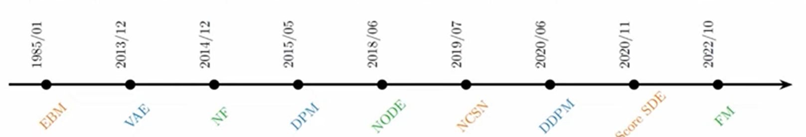
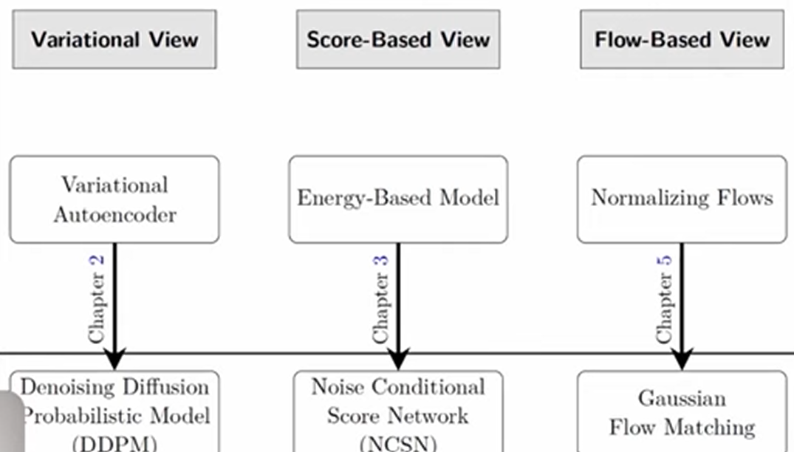

#  The priniples of Diffusion models  from orgin to Advances 
Diffusion models have revolutionized text-to-image synthesis by producing photorealistic and controllable images from textual prompts.

Examples:
- DALL·E
- Stable Diffusion
- Midjourney

Diffusion models are also used to generate 3D molecular structures and protein conformations by modeling the spatial distributions of atoms.

Examples:
- DiffDock
- RFdiffusion

Video diffusion models extend image diffusion models temporally by learning motion dynamics and frame consistency. They can generate videos from text prompts or still images. Early models generated videos of only 3–5 seconds in duration.

Examples:
- Lumiere by Google Research

Diffusion models are also used in robotics for robot policy learning and generating action trajectories. Similarly, they can be applied to speech and music generation. These models have a wide range of applications that continue to grow across different research fields.

## -Part A-  Introduction to deep generative modeling (DGM)

Evolution of the feild of Deep Generative modeling.

- EBM — Energy-Based Models
- VAE — Variational Autoencoders
- NF — Normalizing Flows
- NODE — Neural Ordinary Differential Equations
- NCSN — Noise Conditional Score Networks
- DDPM — Denoising Diffusion Probabilistic Models
- FM — Flow Matching

## -Part B-  Core Prespective on diffusion Models 

## -Part C-  Sampling from diffusion Models
